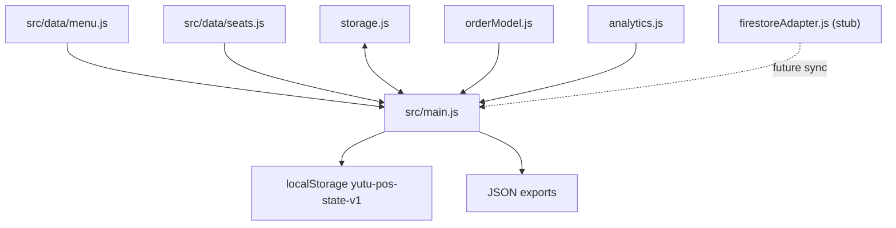

# Architecture

本文件是 YUTU POS v2 開發藍圖。內容以目前程式碼與既有 docs 為基礎，區分「目前已實作」與「v2 建議擴充」。目前正式資料仍以 localStorage 為主，Firestore 僅有 adapter 與 schema 草案，尚未接入主流程。

## 系統定位

YUTU POS 目前是單店咖啡店 POS，核心能力是：

- 內用 / 外帶開單
- 商品點餐、冰熱、內外帶、variant
- 出品狀態
- 現金結帳
- 歷史訂單
- 每日報表與 daily archive
- Dashboard 分析 paid orders
- JSON backup / restore

v2 目標不是做複雜 ERP，而是把 POS 擴充成「咖啡店營運資料庫」：用事件記錄採購、生產、烘豆、銷售、報廢、自用、測試、招待、盤點修正、客源來源，讓後續可以分析營收、成本、庫存批次與營運消耗。

## 現有架構

目前主要模組：

```text
src/main.js
  UI render
  app state normalize
  localStorage persistence
  order actions
  product management
  backup / restore / daily archive
  dashboard render

src/services/orderModel.js
  createOrder
  addOrderItem
  updateOrderItem
  removeOrderItem
  calculateOrder
  checkoutOrder

src/services/analytics.js
  paid order filtering
  overview metrics
  product ranking
  category summary
  temperature summary
  hourly summary
  seat summary

src/services/storage.js
  localStorage load/save

src/services/firestoreAdapter.js
  Firestore schema placeholder
  sync stub

src/data/menu.js
  seed products

src/data/seats.js
  default seats
```

## 模組關係



## Data Flow

### 目前 POS Flow

1. App 啟動時從 localStorage 讀取 state，若沒有資料則使用 `initialState`。
2. `normalizeState` 補齊舊資料缺少的欄位。
3. 使用者建立內用或外帶 open order。
4. 點選商品後，`addOrderItem` 把商品快照加入 order items。
5. `setState` 寫回 localStorage 並重新 render。
6. 結帳時 `checkoutOrder` 將 order 改為 paid，付款方式固定為 `cash`。
7. Dashboard 與歷史報表只讀 paid orders。
8. full backup 匯出 state 原始資料；daily report / daily archive 匯出指定日期 paid orders 與摘要。

### v2 建議營運事件 Flow

v2 建議新增 `businessEvents` 與 `inventoryLots` 作為長期資料來源：

```text
採購 / 生產 / 烘豆 / 報廢 / 自用 / 測試 / 招待 / 盤點
  -> businessEvents[]
  -> 視事件類型建立或消耗 inventoryLots[]
  -> analytics 依 date 篩選彙總
  -> dailyClosing 保存摘要，不複製所有明細
```

銷售仍以 paid orders 為主。報廢、自用、測試、招待不應被做成特殊例外，而是商品或庫存的一種 usage type，計入成本與庫存流向，但不產生營收。

Analytics 真相來源優先順序：

```text
orders + businessEvents -> primary truth
inventoryLots.remainingQuantity -> operational cache
dailyClosings -> snapshot summary
inventoryItems.currentStock -> legacy/cache only
```

`inventoryLots.remainingQuantity` 可用於現場快速查看甜點與熟豆庫存，但必要時應可由 source event + consumption events 重算或稽核。

## 各模組職責

### `main.js`

目前職責過多：UI、state、normalize、資料操作、匯出、頁面路由都集中在同一檔。v2 可先維持現況，但建議逐步抽出：

- `businessEvents.js`：事件 normalize、建立、彙總。
- `inventoryLots.js`：批次庫存 normalize、建立 lot、消耗 lot、庫存摘要。
- `customerSource.js`：客源常數、label、summary。
- `backupModel.js` 或 `exportModel.js`：full backup、daily report、daily archive、未來 master export payload 組裝。

原因：避免 `main.js` 變成所有營運資料邏輯的單點。

本輪只規劃 service 分工，不建立空 service 檔案；等 Phase 1 實作資料 normalize / export 時，再把實際函式抽出，避免產生沒有行為的空模組。

### `orderModel.js`

目前只負責訂單與 orderItem。v2 建議新增：

- `customerSource`
- `customerSourceNote`

仍不建議讓 `orderModel.js` 處理 business events 或 inventory lots，避免銷售流程被營運事件邏輯綁住。

### `analytics.js`

目前只分析 paid orders。v2 建議擴充成接受：

```js
buildAnalyticsDashboard(orders, {
  businessEvents,
  inventoryLots,
  startDate,
  endDate,
  ...
})
```

新增分析應保持只讀，不修改 state。

### `storage.js`

目前只封裝 localStorage read/write。v2 可維持不變。

### `firestoreAdapter.js`

目前不是正式同步功能。v2 若接 Firebase，建議以長期 collections 為主：

- `orders`
- `products`
- `dailyClosings`
- `businessEvents`
- `inventoryLots`
- `settings`

不要每天建立一份資料表；用 `date` 欄位查詢。

## v2 架構原則

- 以事件為核心，不以庫存表為核心。
- `orders` 是銷售原始資料。
- `businessEvents` 是非銷售營運事件原始資料。
- `inventoryLots` 是甜點與熟豆批次庫存的原始/快取混合資料。
- `dailyClosings` 只存當日摘要，不複製所有明細。
- Dashboard 與報表應可由原始資料重新計算。
- Analytics 應以 `orders + businessEvents` 為主要真相來源。
- `inventoryLots.remainingQuantity` 是營運快取，不是不可挑戰的唯一真相。
- `inventoryItems.currentStock` 屬於 legacy / 快取欄位，不作為 v2 唯一真相來源。
- 不做複雜配方扣料，不追求每克絕對精準。
- 甜點與熟豆優先支援批次庫存。
- 牛奶、雞蛋、麵粉等原料先只記採購與盤點。

## 現有架構不足與建議

- `main.js` 太集中：新增 v2 資料模型前，建議抽出 services，降低風險。
- `inventoryMovements` 已預留但語意較窄：v2 建議以 `businessEvents` 為主，`inventoryMovements` 保留相容或後續遷移。
- Firestore schema 舊：需要新增 businessEvents、inventoryLots、dailyClosings、customerSource。
- JSON full backup 尚未包含 v2 所需 `businessEvents` / `inventoryLots`。
- Customer Source 尚未存在：應先補 order 層級欄位，預設 `not_asked`，不影響結帳速度。
- `inventoryItems` / `inventoryMovements` 應保留在 export 中作為 legacy 相容層；v2 庫存主資料來源仍應是 `businessEvents` / `inventoryLots`。
- `docs/firestore-schema.md` 目前是 legacy draft，v2 schema 以 `DATABASE_SCHEMA.md` 為優先藍圖。
- `main.js` 不應繼續承擔所有 v2 邏輯；Phase 1 起應優先把資料語意、normalize、summary、export payload 組裝抽到 services。
# IA Naming Note

YUTU POS v2 介面命名以現場操作任務為主：`POS 點餐`、`銷售紀錄`、`營運紀錄`、`資源管理`、`經營分析`、`備份與日結`。其中 `資源管理` 目前只代表甜點與熟豆批次；`營運紀錄` 記錄採購、報廢、自用、測試與招待，不影響銷售訂單。
